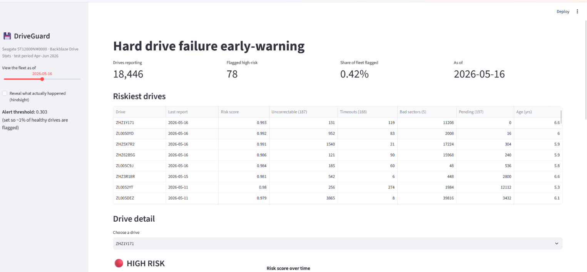
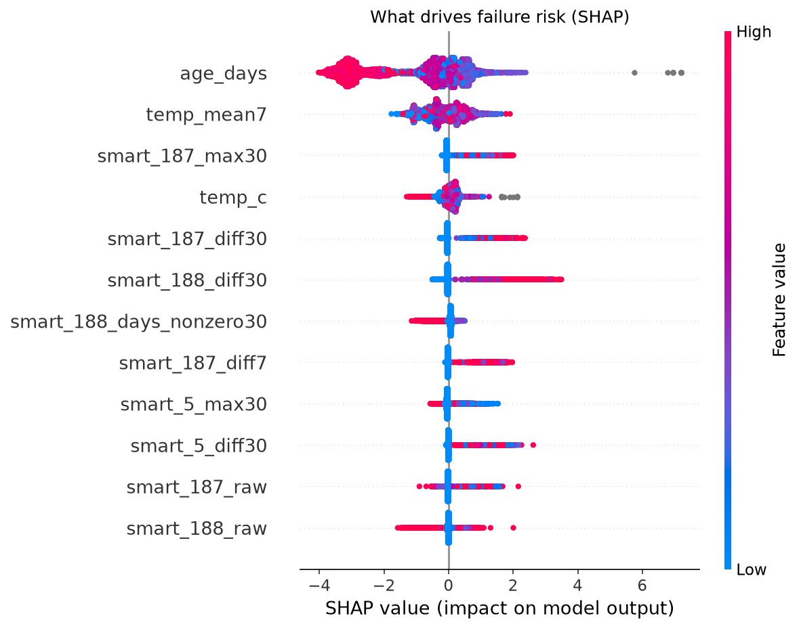
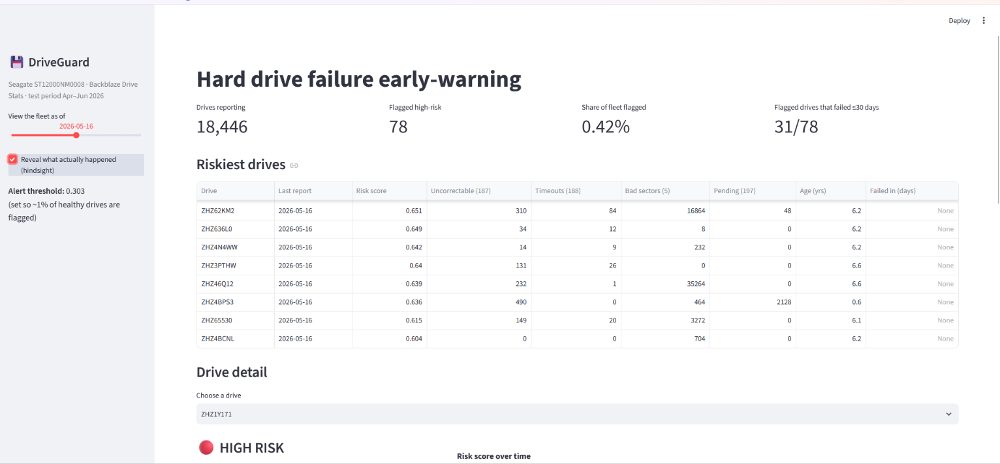

# DriveGuard: Predicting Hard Drive Failures from SMART Data

An early-warning system that reads the daily health reports of data-centre hard drives, predicts which drives will fail within the next 30 days, and explains why in plain English.

Built on **123 million daily SMART records** from **365,976 drives** (Backblaze Drive Stats, July 2025 – June 2026).



---

## The problem

Large storage fleets lose drives every day. A sudden failure means rebuild time, a window of data-loss risk, and emergency replacement work. If a drive can be flagged **weeks before it dies**, it can be swapped during planned maintenance instead.

Every drive reports **SMART** health counters each day: bad sectors, uncorrectable errors, command timeouts, temperature, age. The question is whether those counters can predict failure well enough to act on, without flooding engineers with false alarms.

## Results

**Test period:** Apr – Jun 2026 (never seen during training). **Fleet:** 18,521 Seagate ST12000NM0008 drives, of which **145 failed**.

Both methods are tuned to flag the **same share of healthy drives**, so the comparison is fair:

| Healthy drives flagged | SMART-threshold rule | **LightGBM model** |
|---|---|---|
| 0.5% | 50 / 145 (34%) | **112 / 145 (77%)** |
| 1% | 72 / 145 (50%) | **118 / 145 (81%)** |
| 2% | 98 / 145 (68%) | **123 / 145 (85%)** |
| 5% | 122 / 145 (84%) | **126 / 145 (87%)** |

At the **1% false-alarm** setting:
- **81%** of failing drives are caught (vs 50% for the rule)
- **Median warning: 18 days** before failure
- **65%** of failing drives are warned **7+ days** ahead, enough time to plan a swap

The model's advantage is largest exactly where operations care most: when false alarms must stay low.

## Key findings

**1. SMART errors carry a real but incomplete signal.** On the day they failed, drives showed non-zero error counters far more often than healthy drives:

| SMART attribute | Healthy drive-days | Failure days |
|---|---|---|
| 5: Reallocated sectors | 5.0% | 60.4% |
| 187: Uncorrectable errors | 1.5% | 28.8% |
| 197: Pending sectors | 1.9% | 58.2% |
| 198: Offline uncorrectable | 1.3% | 42.9% |

But ~40% of failed drives had **zero** reallocated sectors, and 5% of healthy drives had some. A fixed rule either misses failures or raises thousands of false alarms. That's why we need a model.

**2. Trends beat raw values.** The most important features are *how fast* uncorrectable errors (187) and timeouts (188) are rising over 7 and 30 days, not their current values.



**3. Older drives in this fleet are *less* risky.** This is likely survivor bias: weak drives from the batch already failed early.

## Approach

```
Backblaze daily CSVs (~48 GB, 4 quarters)
  → DuckDB: keep 12 columns, write Parquet (CSV → ~2-4 GB)
  → Fleet analysis: annualized failure rate by model and age
  → Pick model ST12000NM0008 (most failures, full Seagate SMART set)
  → Label: "fails within the next 30 days"
  → Polars features: 7/30-day error growth, rolling peaks, days-with-errors, reporting gaps
  → LightGBM, time-based split with 30-day embargo
  → Evaluate vs SMART-threshold rule at equal false-alarm rates
  → SHAP: plain-English reasons per drive
  → Streamlit dashboard
```

### Engineering decisions that matter

| Decision | Why |
|---|---|
| **Time-based split** (train Jul 2025 – Feb 2026, test Apr – Jun 2026) | A random split would let the model see the future and inflate scores. |
| **30-day embargo** (March excluded) | Training labels near the split would leak information about test-period failures. |
| **Dropped the last 29 days of healthy rows** | Right-censoring: we can't know whether a drive "healthy" on 20 June dies in July. |
| **Date-based rolling windows** | Drives skip days in the data, so "last 7 rows" ≠ "last 7 days". |
| **Decoded SMART 188** | Seagate packs three 16-bit counters into one 48-bit value (e.g. `184,697,356,498` = `0x002B_00D2_00D2` → 210 timeouts). Read raw, it produced nonsense explanations. |
| **Drive-level evaluation at fixed false-alarm rates** | Accuracy is meaningless at 0.2% positives. What matters operationally is failures caught per false alarm. |
| **Tuned rule baseline** | Compared against a rule with an adjustable threshold, not just "any error > 0", so the baseline isn't a straw man. |

## Dashboard

`streamlit run app/dashboard.py`

- **Time-travel slider:** view the fleet as of any date in the test period
- **Risk ranking:** the 50 riskiest drives with key SMART counters
- **Drive detail:** risk score over time, SMART history, and the top reasons behind the score
- **Hindsight mode:** reveals which flagged drives actually failed



## Project structure

```
driveguard/
├── notebooks/
│   ├── 01_data_ingestion.ipynb    # CSV → Parquet with DuckDB
│   ├── 02_fleet_analysis.ipynb    # AFR by model/age, SMART warning signs
│   ├── 03_features.ipynb          # 30-day labels + trend features (Polars)
│   ├── 04_model.ipynb             # LightGBM vs rule, time-split evaluation
│   └── 05_explain.ipynb           # SHAP + dashboard data
├── app/dashboard.py               # Streamlit app
├── src/ingest.py                  # Script version of ingestion
├── images/
└── requirements.txt
```

## Run it yourself

1. Download quarterly data from [Backblaze Drive Stats](https://www.backblaze.com/cloud-storage/resources/hard-drive-test-data) into `data/raw/` (one folder per quarter).
2. `pip install -r requirements.txt`
3. Run notebooks `01` → `05` in order.
4. `streamlit run app/dashboard.py`

## Limitations and next steps

- **One drive model.** SMART attributes differ by vendor; generalising across models (train on one, test on another) is the next experiment.
- **Age may be a proxy for drive batch.** Test-period drives are older than any seen in training; an ablation without `age_days` would check how much the model relies on it.
- **One test quarter, 145 failures.** Results should be confirmed over more quarters.
- **Next:** survival analysis (predict *days* to failure), probability calibration, and a FastAPI scoring service.

## Tech stack

Python · DuckDB · Parquet · Polars · pandas · LightGBM · scikit-learn · SHAP · Plotly · Streamlit · Jupyter

## Data

Data: [Backblaze Drive Stats](https://www.backblaze.com/cloud-storage/resources/hard-drive-test-data), used under Backblaze's terms (cite Backblaze as the source; data is provided as-is).

## Author

**Chetan Kumar** · [GitHub @chetank-github](https://github.com/chetank-github) · [LinkedIn](https://www.linkedin.com/in/chetank-ln/)
